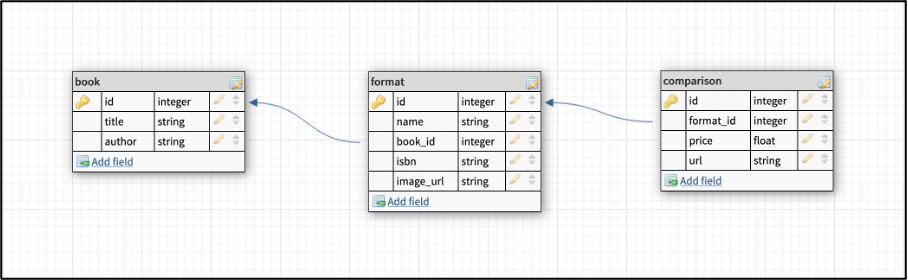

# Price Comparison Website
I did this project as a part of my Third Year Computer Science studies at Middlesex University.

### Used technologies
- Webscraper (Java)
  - Maven
  - Spring
  - Hibernate
  - JSoup
  - JUnit
- Website
  - Frontend: HTML, Bootstrap, VueJS
  - Backend (Javascript): NodeJS with Express
  - Testing: Mocha.js, Chai.js
- Database (MySQL)

## Website description
The Price Comparison website collects data of books from different online stores and displays them to a user. The website can be divided into two major parts: data collection and product display. 

## Data collection
Data collection is done with web scraping written in Java. Since there are too many books in stores to compare, the scraper looks for books in fantasy category only. Scrapers open a page of the website with a list of all books in fantasy category, parse the necessary data by using JSoup and save the collected data into database.

Saving to the database is managed by Hibernate which nicely maps SQL tables onto Object Oriented format. There are three tables in the database called book, format, comparison. The table book stores title and author of a book. Format information is stored in the table format with ISBN (unique for each format of a book) and linked to book table with foreign key relationship. The data needed for comparison of price between different stores is stored in comparison table with a foreign key link to their book format.

Multi-threading is used to run each scraper for each web store as a separate thread to get improved performance. Technologies such as Maven and Spring were used to make the project more organized and easier to maintain. 

## Product display
The scraped data is displayed in a user-friendly way in form of a website. The website consists of backend and frontend parts.

The backend part is a REST API server implemented with NodeJS which reads data from the database, converts it to JSON format and responds to http requests with the data. It can return data of all books (which also can be filtered with a search query) or return data for a specific book by its ID. It implements pagination to avoid sending a too large response at once.
 
The frontend part sends an http request to the backend server to get book data and uses VueJS to display it. It has main page and book information page. The main page shows list of all books or list of all books filtered based on search query. When clicked on a book in the list, the website opens book information page which contains book information, image, and comparison table for each book format available.

## Database design

## Testing
### Web scraper tests
Web scraper tests mainly focus on testing methods that save or read data from the database. A mock test book, format and comparison data is created before each test case to properly test each method and see how they behave. JUnit 5 is used as a testing framework.

### Server tests
Server tests are implemented using Mocha.js as a testing framework and Chai.js as an assertion library. There are five test cases where the first one checks whether the database is working and other four check whether the server is properly responding to requests.

## Screenshots of the system
The screenshots can be found [here](images/screenshots.pdf).
